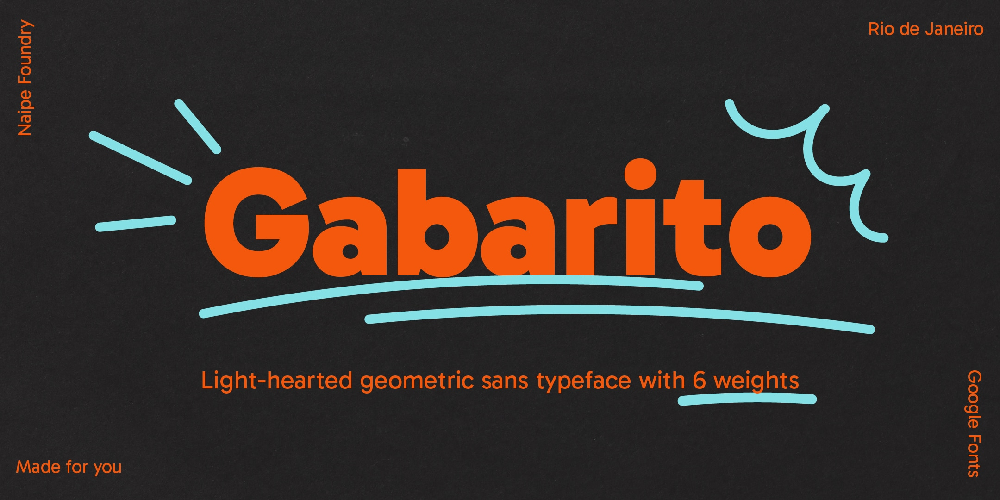
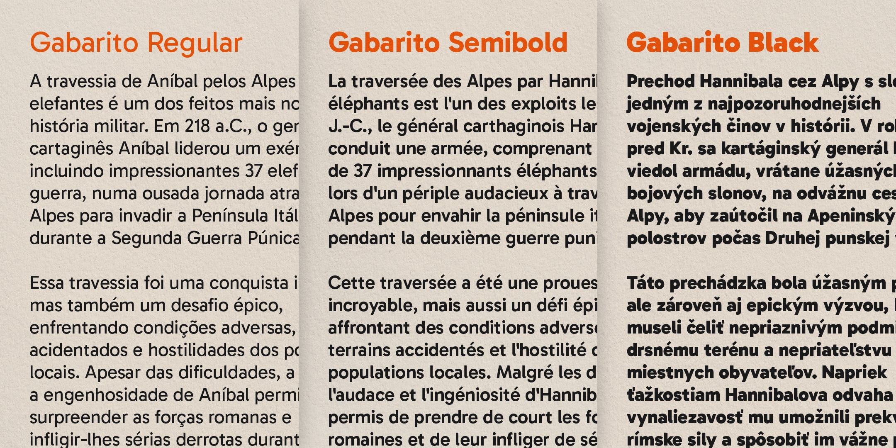
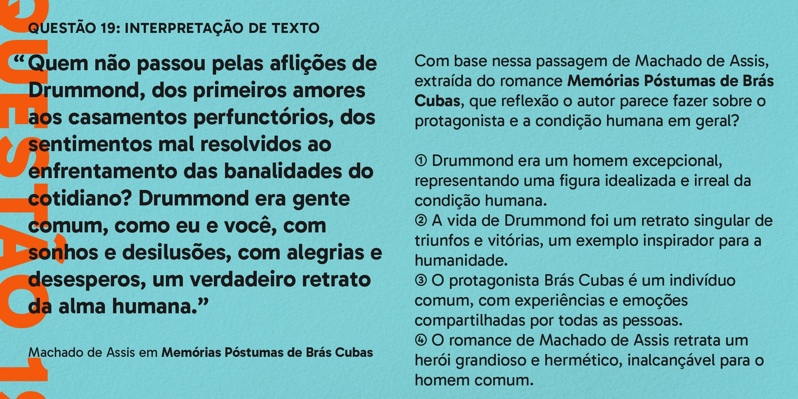
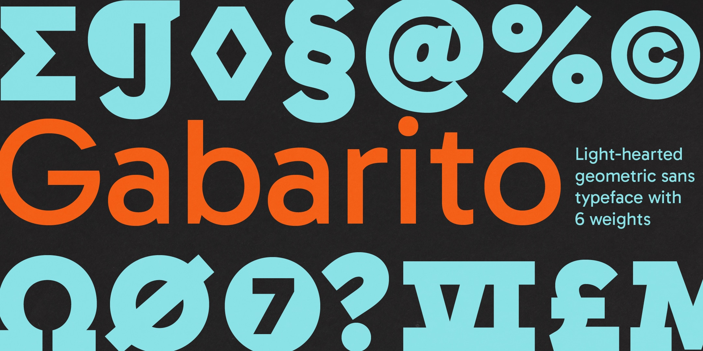
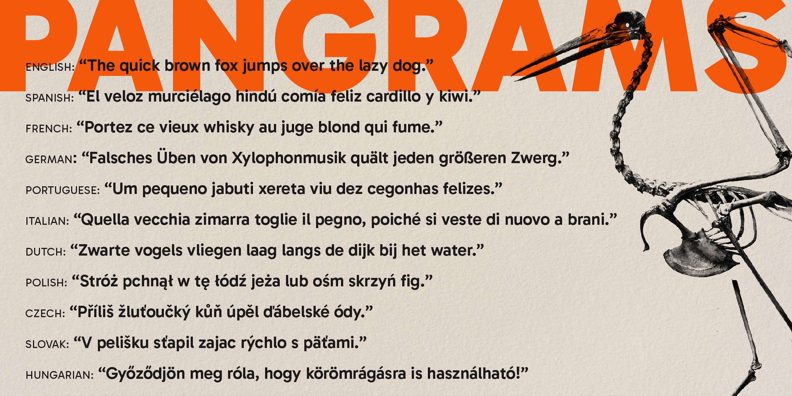
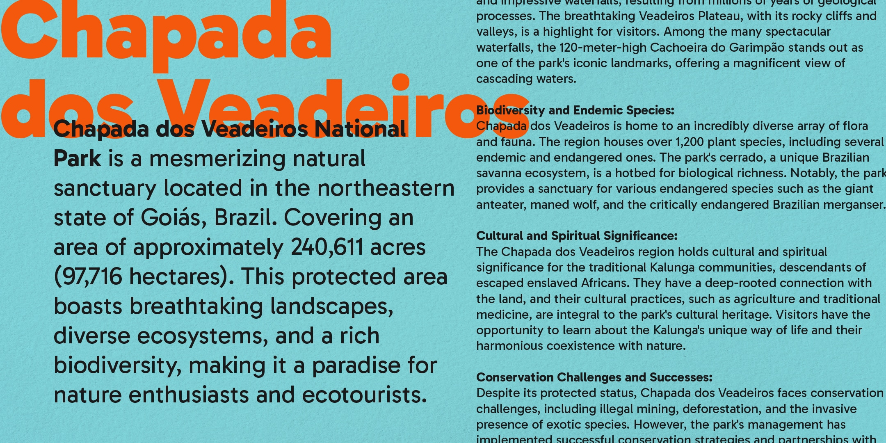

# Gabarito

[![][Fontbakery]](https://naipefoundry.github.io/gabarito/fontbakery/fontbakery-report.html)
[![][Universal]](https://naipefoundry.github.io/gabarito/fontbakery/fontbakery-report.html)
[![][GF Profile]](https://naipefoundry.github.io/gabarito/fontbakery/fontbakery-report.html)
[![][Outline Correctness]](https://naipefoundry.github.io/gabarito/fontbakery/fontbakery-report.html)
[![][Shaping]](https://naipefoundry.github.io/gabarito/fontbakery/fontbakery-report.html)

[Fontbakery]: https://img.shields.io/endpoint?url=https%3A%2F%2Fraw.githubusercontent.com%2Fnaipefoundry%2Fgabarito%2Fgh-pages%2Fbadges%2Foverall.json
[GF Profile]: https://img.shields.io/endpoint?url=https%3A%2F%2Fraw.githubusercontent.com%2Fnaipefoundry%2Fgabarito%2Fgh-pages%2Fbadges%2FGoogleFonts.json
[Outline Correctness]: https://img.shields.io/endpoint?url=https%3A%2F%2Fraw.githubusercontent.com%2Fnaipefoundry%2Fgabarito%2Fgh-pages%2Fbadges%2FOutlineCorrectnessChecks.json
[Shaping]: https://img.shields.io/endpoint?url=https%3A%2F%2Fraw.githubusercontent.com%2Fnaipefoundry%2Fgabarito%2Fgh-pages%2Fbadges%2FShapingChecks.json
[Universal]: https://img.shields.io/endpoint?url=https%3A%2F%2Fraw.githubusercontent.com%2Fnaipefoundry%2Fgabarito%2Fgh-pages%2Fbadges%2FUniversal.json

**Gabarito** is a light-hearted geometric sans typeface with 6 weights ranging from Regular to Black originally designed for an online learning platform in Brazil. 

Named after the Brazilian Portuguese work for an answer sheet, Gabarito was made to help young people learn and overcome the university entry exams known as "vestibular", and it did that by packing lots of high-school level symbols and figures into a very friendly voice that was equal parts functional and engaging.

Beyond the Google Fonts Latin Core Character set which supports over several latin alphabet languages, Gabarito also includes things like Logic and Set Theory symbols, scientific inferiors and superiors, extensive math operators, roman numerals and anything else a high-schooler may need for their homework.

The initial design was comissioned in 2017, started by Leandro Assis and Álvaro Franca, it then got developed and improved further in 2020 by Álvaro Franca and Felipe Casaprima, and finally in 2023 it got a little bit of a makeover in order for it's debut in the commons, that last part with a lot of help from Henrique Beier of Harbor Type.

## About

[**Naipe Foundry**](naipe.xyz/) is the type design, lettering & font production practice of Álvaro Franca & Felipe Casaprima. Out of Rio de Janeiro 🇧🇷, but based in Barcelona 🇪🇸 Perth 🇦🇺 and everywhere in between 🌎 Naipe is passionate about making language visible, creating ways for a text to achieve a tone of voice.

[**Harbor Type**](https://www.harbortype.com/) is an independent type foundry run by Henrique Beier from Porto Alegre, Brazil.

**Naipe** designed Gabarito in 2017, and **Harbor Type** helped them fix it to bring it into the commons.

## Building

Fonts are built automatically by GitHub Actions - take a look in the "Actions" tab for the latest build.

If you want to build fonts manually on your own computer:

* `make build` will produce font files.
* `make test` will run [FontBakery](https://github.com/googlefonts/fontbakery)'s quality assurance tests.
* `make proof` will generate HTML proof files.

The proof files and QA tests are also available automatically via GitHub Actions - look at https://naipefoundry.github.io/gabarito.

## Changelog

**01 August 2023. Version 1.0**
— Inital release of Gabarito

## License

This Font Software is licensed under the SIL Open Font License, Version 1.1.
This license is available with a FAQ at
https://scripts.sil.org/OFL

## Repository Layout

This font repository structure is inspired by [Unified Font Repository v0.3](https://github.com/unified-font-repository/Unified-Font-Repository), modified for the Google Fonts workflow.
